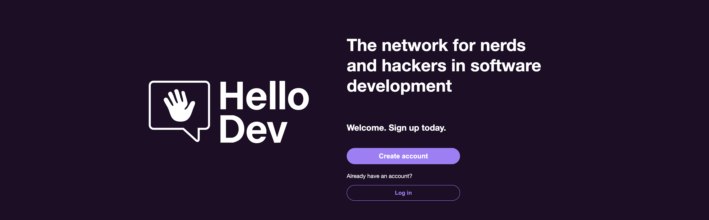

# HelloDev.social

## About

HelloDev is the capstone project of our one-year Web Development course at the **Digital Career Institute (DCI)**  
*(September 2024 – September 2025)*.  
It is a **full-stack social network built by developers, for developers**, designed and implemented end-to-end by our team.

Core development took place **11 August – 21 September 2025**.  
The project is live and open for exploration, but intended as a **learning and showcase platform**, not for permanent production use.

---

## Purpose

Create a **developer-focused social network** with:

- **Real-time features**: private chat, intelligent matching, live notifications  
- **Privacy-first design**: encrypted messages and selective profile visibility  
- **Target group**: coding bootcamp graduates, career starters, and experienced engineers seeking collaboration and mentoring

---

## Tech Stack

**Frontend**  
- React 18, CSS Modules  
- Vercel deployment

**Backend**  
- Node.js, Express  
- MongoDB database  
- Render deployment

**Collaboration & Design**  
- GitHub, Jira  
- Adobe Illustrator, Excalidraw

---

## Team

Built by **Merge & Pray** (GitHub organization):

- [Sarah Domscheit](https://github.com/SarahDomscheit)  
- [Ben Nurtjipta](https://github.com/benNurtjipta)  
- [Calle Görsch](https://github.com/cmgoersch)

Repository: [Merge-Pray/HelloDev](https://github.com/Merge-Pray/HelloDev)

---

## Outlook

Future iterations may add:
- Advanced matching and discovery features
- Gamification (badges, points)
- Integrated code challenges and editor
- Scalability for larger user bases

---

**HelloDev.social – Where code meets community.**